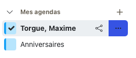
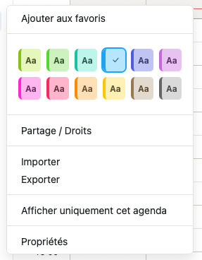
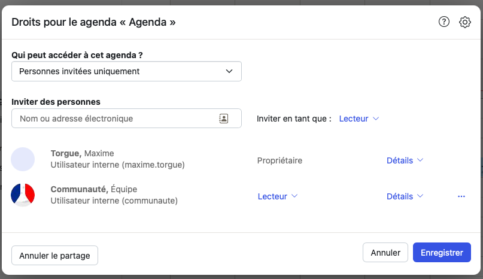
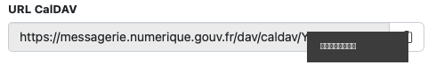

# 📅 Activer les rappels de réunion

Le bot **betabot** peut t'envoyer un message privé **~15 min avant chaque
réunion** de ton agenda La Suite. C'est **opt-in** : tu t'inscris toi-même, et
tu peux te désinscrire à tout moment.

Pour ça, le bot doit pouvoir **lire ton agenda**. Deux choses à faire une seule
fois :

1. **Partager** ton agenda avec le compte du bot `communaute@beta.gouv.fr` (lecture seule).
2. Lui donner l'**URL CalDAV** de ton agenda.

Ensuite, une commande dans Tchap et c'est réglé.

> ⚠️ **Ton URL CalDAV est personnelle.** Ne la colle **jamais** dans un salon
> public — uniquement dans le message privé du bot.

---

## Étape 1 — Ouvre le menu de ton agenda

Dans **La Suite → Agenda**, colonne « Mes agendas » à gauche, survole ton
agenda (à ton nom) et clique sur le bouton **…**.



## Étape 2 — Ouvre « Partage / Droits »

Dans le menu, clique sur **Partage / Droits**.



## Étape 3 — Invite le bot en lecture

Dans **« Inviter des personnes »**, saisis `communaute@beta.gouv.fr`, choisis
le rôle **Lecteur** (« Inviter en tant que : Lecteur »), puis **Enregistrer**.



> C'est ce partage qui autorise le bot à lire ton agenda. **Sans lui,
> l'inscription échoue** (le bot te le dira).

## Étape 4 — Copie l'URL CalDAV

Rouvre le menu **…** de ton agenda → **Propriétés**. Le champ **URL CalDAV**
s'affiche : clique sur l'icône de copie à droite.



_(Sur l'image, la fin de l'URL est masquée : c'est la partie propre à ton
compte, à garder privée.)_

## Étape 5 — Inscris-toi auprès du bot

1. Dans le salon **« Demande d'OPS »**, tape :
   ```
   /rappels-calendrier
   ```
2. Le bot t'écrit en **message privé**.
3. **Colle l'URL CalDAV** copiée à l'étape 4 dans ce message privé.
4. Le bot teste l'accès et confirme :
   > ✅ C'est bon, tu seras prévenu·e avant ton prochain rendez-vous.

---

## Recevoir / arrêter les rappels

- Tu reçois un DM **~15 min avant** chaque réunion :
  > 📅 Rappel : **Weekly tech** dans ~15 min (11:00) avec julien.bouquillon@beta.gouv.fr.
  > 🔗 https://visio.numerique.gouv.fr/…
- Pour **arrêter** les rappels, tape `/rappels-stop` (dans « Demande d'OPS » ou
  en message privé au bot).

## En cas de souci

- **« Je n'arrive pas à lire ton agenda »** → le partage avec
  `communaute@beta.gouv.fr` n'est pas actif, ou l'URL est incorrecte. Refais les
  étapes 3 et 4.
- Toujours bloqué ? Préviens **Maxime** ou **Julien**.
